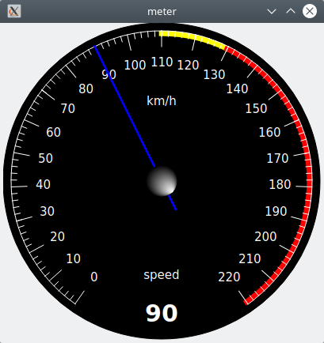

# About

Just Qt widgets.

# Meter

## Code

```cpp
Meter m;
m.setMinValue( 0 );
m.setMaxValue( 220 );
m.setValue( 90 );
m.setBackgroundColor( Qt::black );
m.setNeedleColor( Qt::blue );
m.setTextColor( Qt::white );
m.setGridColor( Qt::white );
m.setLabel( QStringLiteral( "speed" ) );
m.setUnitsLabel( QStringLiteral( "km/h" ) );
m.setRadius( 200 );
m.setStartScaleAngle( 35 );
m.setStopScaleAngle( 325 );
m.setScaleStep( 2 );
m.setScaleGridStep( 10 );
m.setDrawValue( true );
m.setDrawGridValues( true );
m.setDrawValuePrecision( 0 );
m.setScaleLabelPrecision( 0 );
m.setThresholdRange( 0, 110, 0 );
m.setThresholdRange( 110, 130, 1, Qt::yellow );
m.setThresholdRange( 130, 220, 2, Qt::red );
```

## Screenshot


